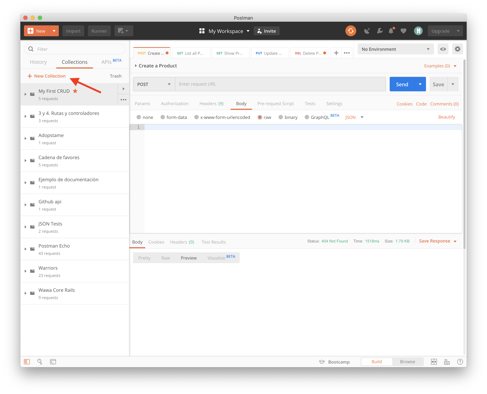
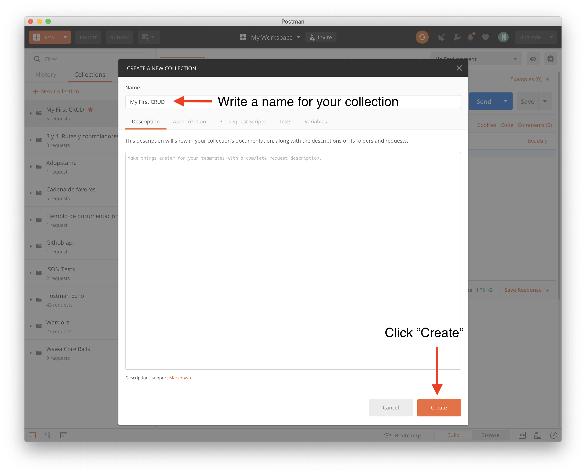
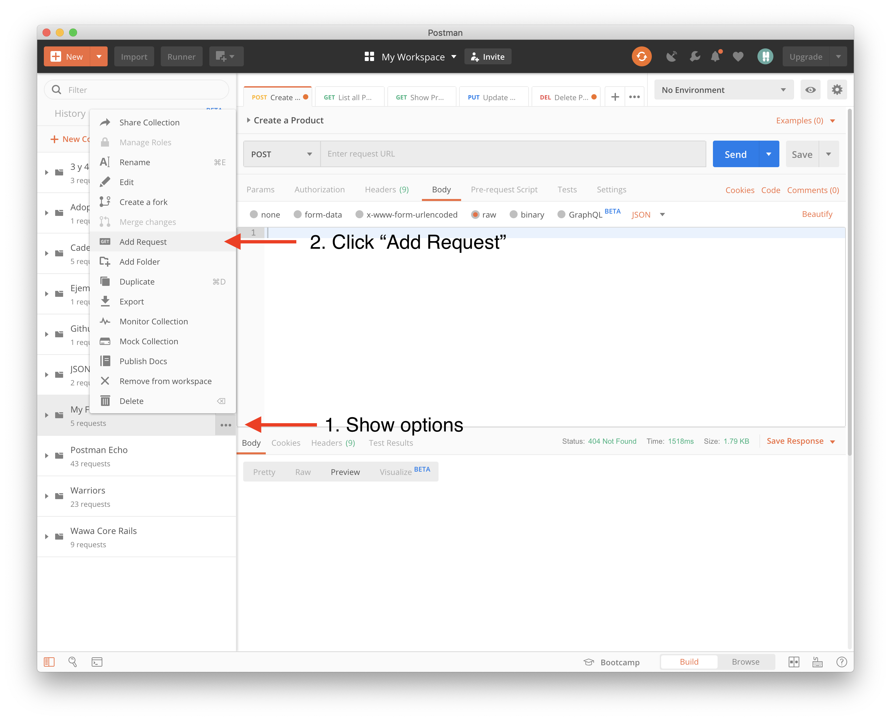
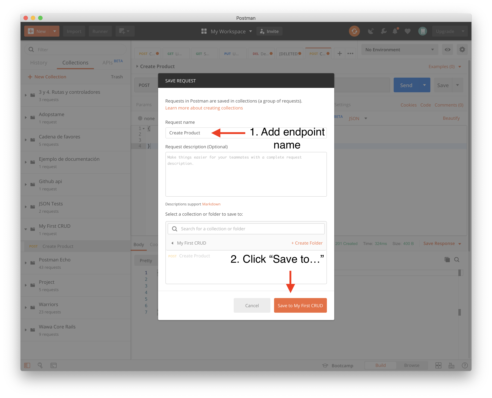
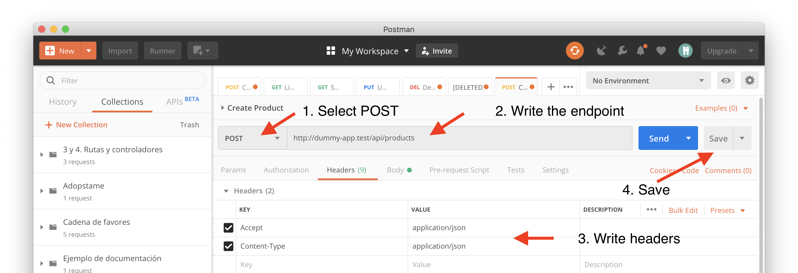
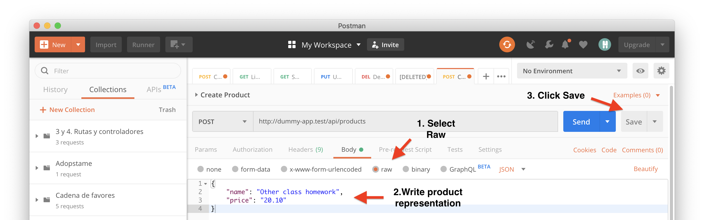

## 1. Objective

Create a CRUD (Create, Read, Update Delete) of Products that will be accessible through the `api/products` endpoint. The goal is to learn the following: 
 
 - How to configure a database
 - A workflow to create API Endpoints
 - Good API architectural practices
 - What are controllers, models, factories and migrations.

## 2. Prerequisites

- Have [PostgreSQL](https://www.postgresql.org) installed
- Have [Postman](https://www.getpostman.com) installed

## 3. A workflow

In the day to day you will be working across all the different layers of your application. During the first times working that way, it can be daunting, since there is still a lot you don't know nor how it works. Nevertheless, I believe is important to get to know the basics of all of this layers so you can start perceiving the value of the framework's architecture. In a typical day you will do something like this:

1. Understand the client necessity
1. Define the API Contract (Endpoints)
1. Create tables in the database (if necessary) using Migrations
1. Create Routes
1. Create Controllers
1. Create Models
1. Create a Factory for testing
1. Create Tests for each endpoint
1. Create a Request in Postman so you can share it across your team 
   
If you don't know some of this concepts don't worry. We will do a deep dive on each of them later. But for know let's try to create a CRUD following the above workflow.

## 4. One time database configuration (Hopefully)

Database configurations is usually a one time thing to do in every project. It's a little complex but once it is done is done. So lets configure our PostgreSQL database with out Laravel project.
  
### 4.1. Enter to the PostgreSQL console

If your database is running locally you should be able to run the following command to enter into the postgresql console:

#### 4.1.1 On Mac/Linux
Just run the following command in your terminal:

```shell
# You can run it in any directory
psql -U postgres 
# Change "postgres" for the name of your user if postgres is not it.

```

#### 4.1.2 On Windows

On Windows, open a command line terminal and go into the directory where PostgreSQL was installed. Usually it is in a directory that looks like this `C:\Program Files\PostgreSQL\x.x\bin`. Then run the following command:

``` shell
psql -U postgres
# Change "postgres" for the name of your user if postgres is not it.
```

If you get tired of going into that directory to run the `psql` command you can add the directory into your command line PATH, that way you will be able to run `psql` in wherever directory you currently are in the command line. Just follow [this tutorial about how to set it up](https://docs.alfresco.com/4.2/tasks/fot-addpath.html). 

### 4.2. Check what databases you already have 

Inside the postgreSQL shell run this command to show all the databases that PostgreSQL have
```shell
\l
# It is a downcase L
```

### 4.3. Creating our Development and Testing Databases

When you work, you usually need a development database and a testing database. The latter should only be used when you run your tests and the former is the one you use to manually validate the changes you are doing into the application. The test database should always have an empty state before each test-run to ensure a clean database state. Since strange data could interfere and give you false positives  when you run the application test suite.  

To create a database run this command inside the PostgreSQL console.

```shell
CREATE DATABASE laravel;
```

> "laravel" is the name of the database but you can change it to anything you want.

Lets see our new database by running `\l`:

```shell
postgres=# \l
                                         List of databases
            Name            |  Owner   | Encoding |  Collate   |   Ctype    |   Access privileges
----------------------------+----------+----------+------------+------------+-----------------------
 laravel                    | postgres | UTF8     | en_US.utf8 | en_US.utf8 |
 postgres                   | postgres | UTF8     | en_US.utf8 | en_US.utf8 |
 template0                  | postgres | UTF8     | en_US.utf8 | en_US.utf8 | =c/postgres          +
                            |          |          |            |            | postgres=CTc/postgres
 template1                  | postgres | UTF8     | en_US.utf8 | en_US.utf8 | =c/postgres          +
                            |          |          |            |            | postgres=CTc/postgres
```

The "laravel" database will be used as your development database. Lets create the test database. 

```shell
create database laravel_test
```

> As before "laravel_test" is just a name and it can be changed.

### 4.4  Configuring the databases in Laravel

By default, laravel knows how to communicate with mysql, sqlite and postgres by using specific drivers. We only need to tell laravel which driver should it use by specifying the driver name on the `.env` file.  The `env` file is where we should put everything that is environment dependent. For example, an application can (and should) use a different database depending if it is being tested using automated tests(testing environment), if it is being used by the mobile team to build new features (staging environment), or if it is deployed to production (production environment)

Add the following to your `.env` file.

```
# .env
DB_CONNECTION=pgsql
DB_HOST=127.0.0.1
DB_PORT=5432
DB_DATABASE=laravel
DB_USERNAME=postgres
DB_PASSWORD=
``` 

Now lets do the same but for our testing environment. Lets create a `env.testing` file that laravel will use when we run our test suite using `phpunit`. Just copy everything in your `.env` file into `.env.testing` and change the DB_DATABASE so it uses the previously created test database.

The database part of `env.testing` should look something like this:

```
DB_CONNECTION=pgsql
DB_HOST=127.0.0.1
DB_PORT=5432
DB_DATABASE=laravel_test
DB_USERNAME=postgres
DB_PASSWORD=
```

Now let's test if our database connections are setup correctly. Run the following command in the project root directory to start a laravel console:

```shell
php artisan tinker
```

> The laravel console runs by default using the variables inside the `.env` file. So every change you make in it will be reflected in your `development` environment.

Inside the laravel console run this command to check if we are connected to the database:

```
DB::connection()->getPdo()
```

If everything when good you should see something like this:
 
```
=> PDO {#2960
     inTransaction: false,
     attributes: {
       CASE: NATURAL,
       ERRMODE: EXCEPTION,
       PERSISTENT: false,
       DRIVER_NAME: "pgsql",
       SERVER_INFO: "PID: 984; Client Encoding: UTF8; Is Superuser: on; Session Authorization: postgres; Date Style: ISO, MDY",
       ORACLE_NULLS: NATURAL,
       CLIENT_VERSION: "11.5",
       SERVER_VERSION: "11.4 (Debian 11.4-1.pgdg90+1)",
       STATEMENT_CLASS: [
         "PDOStatement",
       ],
       EMULATE_PREPARES: false,
       CONNECTION_STATUS: "Connection OK; waiting to send.",
       DEFAULT_FETCH_MODE: BOTH,
     },
   }

```

Now validate your testing environment database by running this command. The laravel console will use the variables inside `.env.testing`.

```shell
php artisan tinker --env=testing 
```

When you run `DB::connection()->getPdo()` you should get the same result as before. If everything is working lets start making our first CRUD!  

## 5. A CRUD of Products

- Run this command in your project root:

```shell
php artisan make:model Product -mcr
```

The above command will:

1. Create a model called `Product.php` inside the `app/` directory.
2. Create a controller called `ProductController.php` inside the `app/Http/Controllers/` directory.
3. Create a migration called `xxxx_xx_xx_xxxx_create_products_table.php` inside the `database/migrations/` directory.
4. Create a factory called `ProductFactory.php` inside the `database/factories/` directory.


### 5.1 Create Product Table

If we open the migration called `xxxx_xx_xx_xxxx_create_products_table.php` you will see something like this:

```php
<?php

use Illuminate\Support\Facades\Schema;
use Illuminate\Database\Schema\Blueprint;
use Illuminate\Database\Migrations\Migration;

class CreateProductsTable extends Migration
{
    /**
     * Run the migrations.
     *
     * @return void
     */
    public function up()
    {
        Schema::create('products', function (Blueprint $table) {
            $table->bigIncrements('id');
            $table->timestamps();
        });
    }

    /**
     * Reverse the migrations.
     *
     * @return void
     */
    public function down()
    {
        Schema::dropIfExists('products');
    }
}
```

This class represents an action that will change the application database schema. If you look closely into the `up` function you can see that it is creating a table named `products` that is going to have an `id` and a set of timestamps. Lets change it a bit and add columns to store the name and price of the products. Your migration should now look something like this:

```php
<?php

use Illuminate\Support\Facades\Schema;
use Illuminate\Database\Schema\Blueprint;
use Illuminate\Database\Migrations\Migration;

class CreateProductsTable extends Migration
{
    /**
     * Run the migrations.
     *
     * @return void
     */
    public function up()
    {
        Schema::create('products', function (Blueprint $table) {
            $table->bigIncrements('id');
            $table->timestamps();
            // A string to store the name
            $table->string('name');
            // A decimal to store the price
            $table->decimal('price');
        });
    }

    /**
     * Reverse the migrations.
     *
     * @return void
     */
    public function down()
    {
        Schema::dropIfExists('products');
    }
}
```

Save the file and run this command in your project root directory to apply the changes in your database:

```shell
php artisan migrate
```

A successful response should look like the following, but if something when wrong try dropping all the database tables using `php artisan migrate:reset`, fix your migration and then run `php artisan migrate` again. For more information about migrations, Laravel offers a more throughout documentation in this [page](https://laravel.com/docs/5.8/migrations).

``` shell
❯ php artisan migrate      
Migrating: 2014_10_12_000000_create_users_table
Migrated:  2014_10_12_000000_create_users_table (0.05 seconds)
Migrating: 2014_10_12_100000_create_password_resets_table
Migrated:  2014_10_12_100000_create_password_resets_table (0.02 seconds)
Migrating: 2019_09_10_154642_create_products_table
Migrated:  2019_09_10_154642_create_products_table (0.02 seconds)
```

### 5.2 Setup Postman

Postman is a collaboration platform for API Development. It allows us to work with APIs easily. It allow us to organize, test and share application APIs between team members and it will help us validate that we are implementing the products API correctly.


Firstly, [install postman](https://www.getpostman.com/product/api-client) in your machine, then follow the instruction bellow to create a new collection for our API.

#### 5.2.1 Create an API Collection

To create a collection just follow these steps (The steps are also shown in the pictures below).

1. Select "+ New Collection".
2. Enter the collection name. 
3. Click "Create"
4. The new collection will appear in the left column of the application.





### 5.3 Create Product

#### 5.3.1 Add Create Product Request to Postman

Before we start implementing the create product endpoint  it's a good idea to add it to the postman collection. To do it just follow these steps:

**Add Request**

1. Click "..." in the API collection
1. Click on "Add Request"



**Complete request creation**

1. Write the endpoint name
1. Click "Save to..."




**Edit the request**

1. Select the POST Http Method
1. Write the url
1. Write the headers
1. Click "Save"




Then click on the "Body" Tap and do the following:

1. Select "Raw"
1. Add the product representation
1. Click "Save"



After all these steps you should see the new request inside your collection. You can try send the request to the application but it will fail. Lets proceed to program the endpoint that will handle this request.

#### 5.3.2  Implement create product endpoint

Firstly, add the route endpoint in `routes/api.php`.

```php 
// routes/api.php

// ... rest of the file

Route::post('products', "ProductController@store");
```

Then in `app/Http/Controllers/ProductController.php` look for the `store` function and add thee following inside it.

```php
// app/Http/Controllers/ProductController.php

/**
  * Store a newly created resource in storage.
  *
  * @param \Illuminate\Http\Request $request
  * @return \Illuminate\Http\Response
  */
 public function store(Request $request)
 {
     // Create a new product
     $product = Product::create($request->all());

     // Return a response with a product json
     // representation and a 201 status code   
     return response()->json($product,201);
 }
```

If you send a request to this endpoint using Postman, you will see an error. This is because Laravel prevents attribute mass assigment by default. Thr reason is to protect your models of malicious clients that will try to manipulate the models internal attributes like the id, timestamps, etc. To enable mass assigment for price and name we need to add this attributes to the `fillable` attribute in our `app/Product.php` model. 

```php
# app/Product.php
<?php

namespace App;

use Illuminate\Database\Eloquent\Model;

class Product extends Model
{
    //
    protected $fillable = [
        'name',
        'price'
    ];


}
```

After adding the attributes you can try sending the request wih Postman again. It should succeed and display the new product name, price, id and timestamps.
 
#### 5.3.3 Create test for create product endpoint

Now, lets add a test that validates that our endpoint creates products correctly. Run in your project root directory this command to create a new ProductTest.

```shell
php artisan make:test ProductTest
```

Add test to validate the product creation should look something like this. 

```php
<?php

namespace Tests\Feature;

use App\Product;
use Illuminate\Foundation\Testing\DatabaseTransactions;
use Tests\TestCase;
use Illuminate\Foundation\Testing\WithFaker;
use Illuminate\Foundation\Testing\RefreshDatabase;

class ProductTest extends TestCase
{
    use RefreshDatabase;
    
    public function test_client_can_create_a_product()
    {
        // Given
        $productData = [
            'name' => 'Super Product',
            'price' => '23.30'
        ];

        // When
        $response = $this->json('POST', '/api/products', $productData); 

        // Then
        // Assert it sends the correct HTTP Status
        $response->assertStatus(201);
        
        // Assert the response has the correct structure
        $response->assertJsonStructure([
            'id',
            'name',
            'price'
        ]);

        // Assert the product was created
        // with the correct data
        $response->assertJsonFragment([
            'name' => 'Super Product',
            'price' => '23.30'
        ]);
        
        $body = $response->decodeResponseJson();

        // Assert product is on the database
        $this->assertDatabaseHas(
            'products',
            [
                'id' => $body['id'],
                'name' => 'Super Product',
                'price' => '23.30'
            ]
        );
    }
    
}
 
```

> **Note** is important to use the trait `RefreshData` in every test file that will touch the database. RefreshData ensures the database is clean every test run. 
 
### 5.4 List All Products

#### 5.4.1 Implement list all products endpoint

#### 5.4.2 Test list all products endpoint

- Create a factory 

### 5.5 Show Product

#### 5.5.1 Implement show product endpoint

#### 5.5.2 Test show product endpoint

### 5.6 Update Product

#### 5.6.1 Implement update product endpoint

#### 5.6.2 Test update product endpoint

### 5.7 Delete Product

#### 5.7.1 Implement delete product endpoint

#### 5.7.2 Test delete product endpoint

