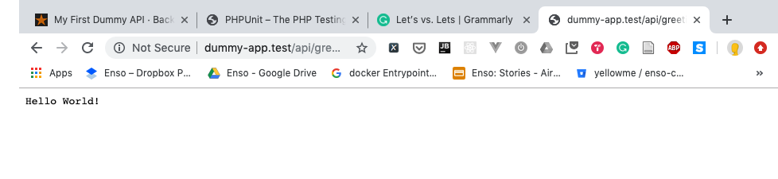

## Objective

Create an API with an endpoint that respond `Hello World!` every time a request is send its way. 

## 1. A little more complex Hello World

### 1.1 Let's start with a test...

Run this command in your terminal inside your project root (e.g. `blog`) to create a new test file. This will be created inside your tests directory.

``` shell
php artisan make:test HelloWorld
```

After that you should have a file named HelloWorldTest inside the `tests/feature` directory that looks something like this:

```php
# tests/Feature/HelloWorldTest.php
<?php

namespace Tests\Feature;

use Tests\TestCase;
use Illuminate\Foundation\Testing\WithFaker;
use Illuminate\Foundation\Testing\RefreshDatabase;

class HelloWorldTest extends TestCase
{
    /**
     * 
     *
     * @return void
     */
    public function testExample()
    {
        $response = $this->get('/');

        $response->assertStatus(200);
    }
}

```

Don't worry much about how it is working right know. Instead let's change it so it reflects what we want our API to do. As explained in the objective we want to create an endpoint `/greeting` that respond `Hello World!` so lets do that. 

```php
# tests/Feature/HelloWorldTest.php
<?php

namespace Tests\Feature;

use Tests\TestCase;
use Illuminate\Foundation\Testing\WithFaker;
use Illuminate\Foundation\Testing\RefreshDatabase;

class HelloWorldTest extends TestCase
{
    /**
     * A basic feature test example.
     *
     * @return void
     */
    public function test_when_client_send_a_request_a_hello_world_is_responded()
    {
        
        # When
        # we send a GET request to the url /greeting
        $response = $this->get('api/greeting');

        # Then
        # We receive a HTTP status code of 200 (OK)
        $response->assertStatus(200);
        # We receive the texts "Hello World!" inside the response
        $response->assertSeeText('Hello World!');
    }
}
```
> **Note:** phpunit look for php files that end with the sufix `*Test.php` and runs every functions that start with the `test` prefix. Don't forget to name your files and tests functions correctly!
 
 > **Note:** 
Now that we have a test that reflects what we want to accomplish, lets run it to watch it fail. Don't be too sad, as creating a test to watch it fail is a common [Test Driven Development](https://en.wikipedia.org/wiki/Test-driven_development) workflow. To run our tests we would use [phpunit](https://phpunit.de/). Fortunately, it is already installed with Laravel, so you don't have to installed yourself. Use the command below to run your tests.

```shell
# On Mac/Linux:
vendor/bin/phpunit

# On Windows:
vendor\bin\phpunit
``` 

This should give you a response that looks something like this: 

```shell
❯ vendor/bin/phpunit
PHPUnit 7.5.15 by Sebastian Bergmann and contributors.

..F                                                                 3 / 3 (100%)

Time: 344 ms, Memory: 16.00 MB

There was 1 failure:

1) Tests\Feature\HelloWorldTest::testExample
Expected status code 200 but received 404.
Failed asserting that false is true.

/Users/hidalgofdz/development/yellowme/backend-fundamentals-examples/dummy-app/vendor/laravel/framework/src/Illuminate/Foundation/Testing/TestResponse.php:151
/Users/hidalgofdz/development/yellowme/backend-fundamentals-examples/dummy-app/tests/Feature/HelloWorldTest.php:25

FAILURES!
Tests: 3, Assertions: 3, Failures: 1.

``` 

If you take a closer look, you will notice that phpunit is already telling us which assertion when wrong, the one in line 25 in HelloWorldTest.php. That assertion expect our endpoint to return a HTTP Status code of 200 but it is returning a 404, to fix it, we should define the endpoint `api/greeting` in our application so it knows what to do when a client send a request in that way.

### 1.2 Creating our greeting endpoint

Go to `routes/api.php` and add this at the bottom:

```php
# routes/api.php

Route::get('/greeting', function (Request $request){
    return '';
});
```

After that lets run `vendor/bin/phpunit` again:

```shell
❯ vendor/bin/phpunit     
PHPUnit 7.5.15 by Sebastian Bergmann and contributors.

..F                                                                 3 / 3 (100%)

Time: 128 ms, Memory: 16.00 MB

There was 1 failure:

1) Tests\Feature\HelloWorldTest::testExample
Failed asserting that '' contains "Hello World!".

/Users/hidalgofdz/development/yellowme/backend-fundamentals-examples/dummy-app/vendor/laravel/framework/src/Illuminate/Foundation/Testing/TestResponse.php:389
/Users/hidalgofdz/development/yellowme/backend-fundamentals-examples/dummy-app/tests/Feature/HelloWorldTest.php:27

FAILURES!
Tests: 3, Assertions: 4, Failures: 1.

```

The error has changed! Every time something changes there is progress. The new error says our app is returning the correct text so lets change that. 

```php
# routes/api.php

Route::get('/greeting', function (Request $request){
    return 'Hello World!';
});
```

Let's run `vendor/bin/phpunit` again. The tests should be all green.

```shell
❯ vendor/bin/phpunit
PHPUnit 7.5.15 by Sebastian Bergmann and contributors.

...                                                                 3 / 3 (100%)

Time: 335 ms, Memory: 16.00 MB

OK (3 tests, 4 assertions)
```  

Now lets see our baby (I'm talking about the API) correctly respond to the `/api/greeting` request. Just deploy your application, open a browser and write a url that looks something like this: [http://dummy-app.test/api/greeting](http://dummy-app.test/api/greeting). If everything went as planned you will see a white page with the text `Hello World!` at the top.


