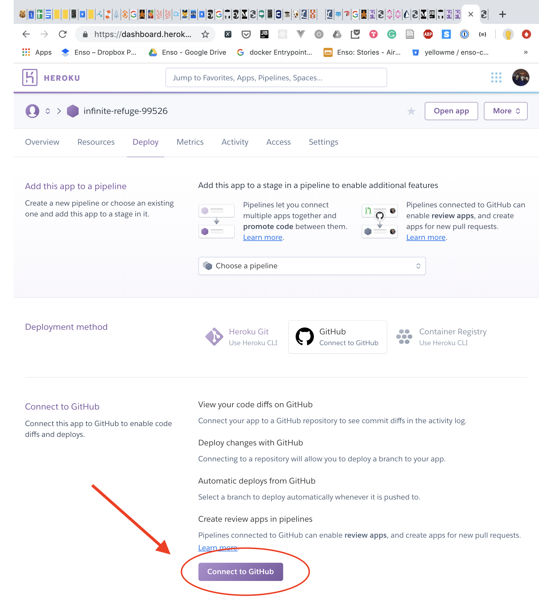
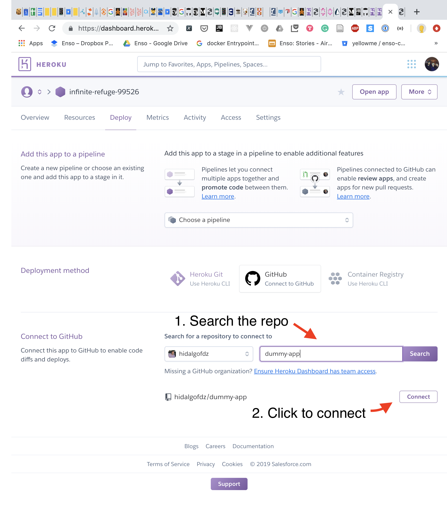
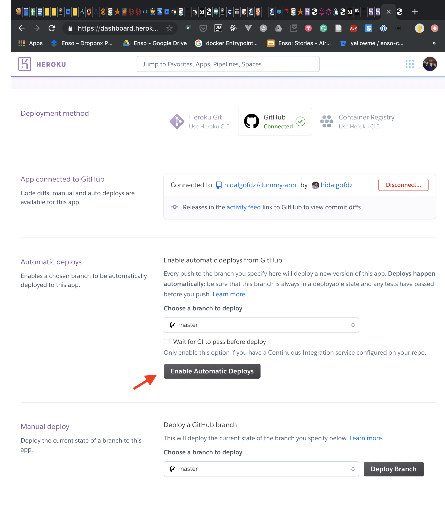

## Objective

Create and deploy to production your first Laravel application. It will not do much but it's honest work. We will create the application that will just show the classic  _New Laravel Application_ page. In addition we will configure our code repository and production environment, and at the end we will create our first continuous integration(CI) pipeline to deploy to production our changes automatically.

  
##  Installation and Configuration

### 1. Setup Environment 

#### Windows

You can install [Laragon](https://laragon.org/download/) or [Homestead](https://laravel.com/docs/5.8/homestead). I have had problems installing Homestead on Windows in the past, so it might not be the best option. If you use Laragon watch this [video](https://www.youtube.com/watch?v=2pQSt9ST22A) after installing it. The video will show you how to create your first Laravel application.

#### Mac 

Firstly you need to install [homebrew](https://brew.sh), then to install Laravel Valet just follow its [installation guide](https://laravel.com/docs/5.8/valet#installation). When you finish you will have installed [homebrew](https://brew.sh), php, [composer](https://getcomposer.org/) and Laravel Valet in your machine.

#### Linux

You can install Homestead following this [instructions](https://laravel.com/docs/5.8/homestead)
  
## 2. Bootstrapping your first application
 
### 2.1 Create a Laravel Project
   1. Follow the [instructions](https://laravel.com/docs/5.8/installation) to create your first Laravel Project.

## 3. Push the app to a Repository

### 3.1 Create a Github Repo

  1. Create a [Github Account](https://github.com/join) (if you don't have one)
  1. [Create a Repo](https://help.github.com/en/articles/create-a-repo)
  1. [Push you application to Github](https://help.github.com/en/articles/adding-an-existing-project-to-github-using-the-command-line)
  
## 4. Push the app to production

####  Setting up Heroku

  1. [Create a Heroku account](https://signup.heroku.com) (if you don't have one)
  1. [Install Heroku CLI](https://devcenter.heroku.com/articles/heroku-cli)
  1. Commit the last changes (if any)
  1. [Prepare and Push Project to production](https://devcenter.heroku.com/articles/getting-started-with-laravel#deploying-to-heroku)

After doing all of these, we should be able to visit a heroku url and see the new Laravel project page.

## 5. Automate deployments when there is a change on master branch

Let's try to follow a common CI deployment process where every time there is a change in our master branch our app gets deployed. I know we do not have tests yet, but we will have them soon. Meanwhile lets configure Heroku to listen for changes in the master branch in our github repository. 

### 5.1 Link your Github account with Heroku

Firstly we need to give Heroku access to our Github. For that do the following:

  1. Go to the Heroku Dashboard.
  2. Select your application from the list.
  3. Select the **Deploy** tab.
  4. Select _Connect to Github_.
  

 
This will redirect you to Github to authorize Heroku.

### 5.2 Configure Github as the deployment method

Once your Github account is connected to Heroku go to the "Deploy" section and do the following:

  1. Go to "Connect to Github", search for the application's repository and then click on "Connect".
  
  
  1. Go to the "Automatic deploys" section and click on "Enable automatic deploys".  

   
    
After this just add something to your master branch and watch it get deployed automatically. :D
