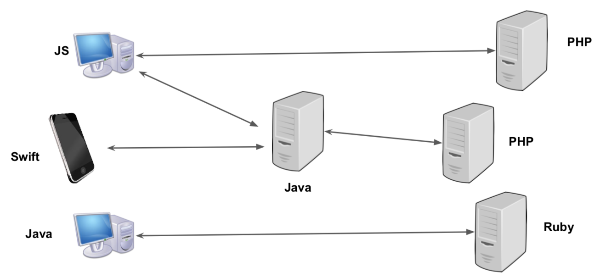
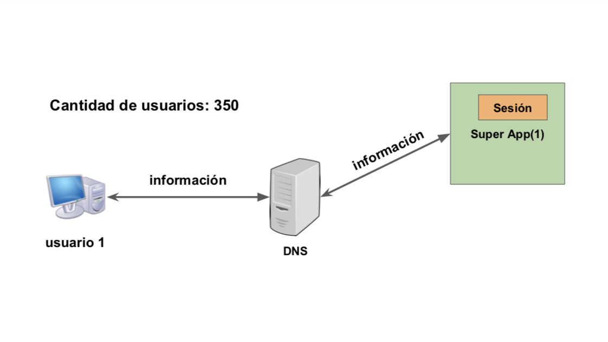
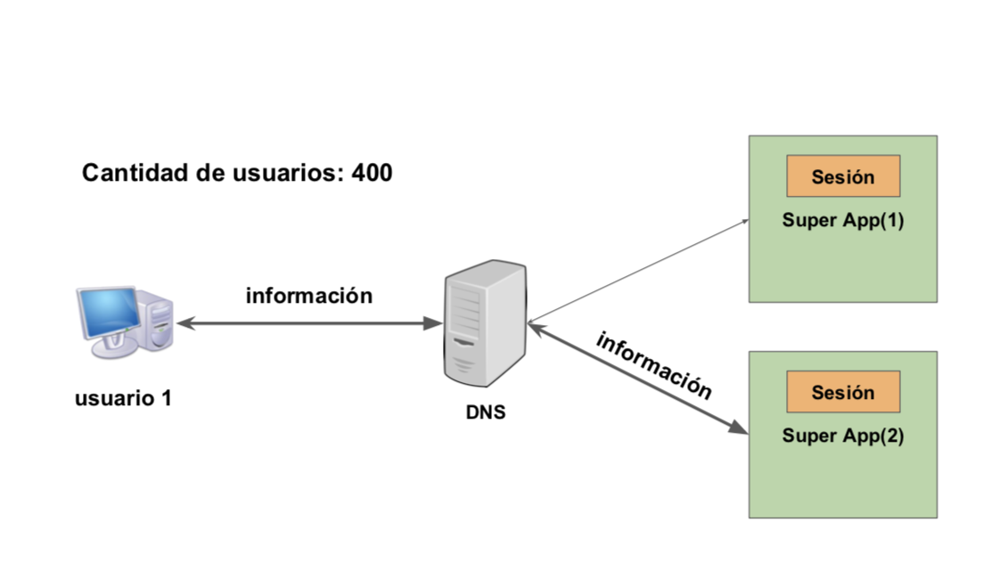
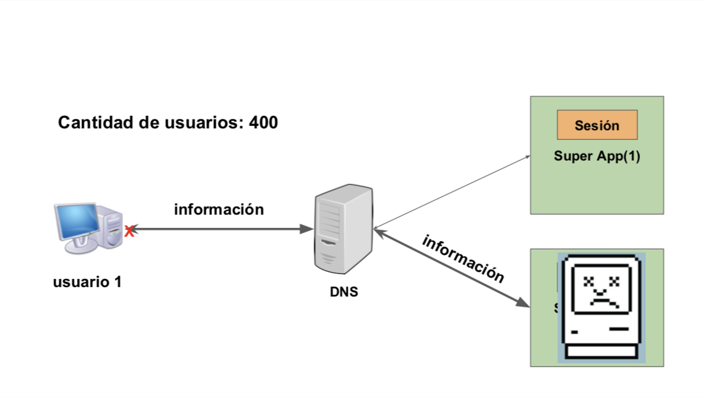

## REST Definition

REST is an acronym for **Representational State Transfer**. REST is an architectural style for building applications, mostly for the web. REST was proposed by _Roy Thomas Fielding_ in his doctoral thesis in the year 2000. Nevertheless, it did not become popular in the  industry until 2008/2009.

It is important to mention that although most today backend applications follow some of the REST architectural characteristics, the majority of them do not conform to the architecture completely.
 
Most, if not all, of the applications that are considered "REST" are web applications, but that doesn't mean that in order to use REST you need to use the HTTP protocol or the web. Actually, you can implement REST using any technology that conforms with the REST architectural characteristics.
 
 
## Why REST?

When _the cloud_ started REST became really popular because most modern applications needed to comply with two things in order to take advantage of the cloud to the fullest. The first one is the necessity for *heterogeneous interoperability* and second one is the necessity of *scalability*.

### Heterogeneous interoperability

Most applications today are built in different platforms and programming languages. You cannot assume in which operating system or device the applications are being run. For that reason, we as engineers needed to find a way to facilitate the communication between applications.

Nowadays, applications must be available in a large number of devices. Computers, cellphones, watches, navigation systems, etc. Each one of them should evolve independently of the server application or their maintenance costs and complexity would be impossible to sustain. In addition, the bandwidth and red availability varies for each device and region and our applications should take that into account to maintain a good usability.

### Scalability

Given that any application could suffer from a high demand of users at anytime, most modern applications should bee designed to be able to scale horizontally. By that I mean that our application should be able to maintain its availability by adding more servers, database replicas, CDNs and other services without having to change the application code. But, in order to be able of doing that our applications should be designed to do it.

#### Example

Imagine we have an application that can sustain 350 concurrent user sessions.

One day our application become popular and it starts having 400 concurrent users. For that reason the team decide to add another server so it can sustain the demand. 

The question is. What will happen if a user session was stored in the first server and the DNS decide to send one of that user requests to the second server?

 
 
 If an application is not designed for horizontal scalability it doesn't matter how many server you add. It will break.
 
#### Elastic Infrastructure
 
 These days, there are many hosting services where you only pay for the hardware you use. This is a good way for a company to scale without having to pay for hardware and its maintenance. Examples of this services are [Heroku](https://www.heroku.com/) an [AWS](https://aws.amazon.com/). 

## REST Architectural Characteristics

The following characteristics, except for Code on Demand, must be followed in order for an application to say that it conforms with REST. In reality, almost no application follows all these characteristics and REST have become more of a series of good practices. So feel free to use what is better to your application.

### Client-Server

Client-Server is a architecture that states the existence of a server in charge of performing a set of services by request, and one or more clients which can request the server to do an specific service and then display its result. The two main subjects are the server and the client(s) and each has an specific role.
 
#### Server

The _server_ who is responsible of:

- Offering a set of services.
- Listening and responding client requests.
- Accepting or declining those client requests.

The server is a **reactive** process in charge of providing a set of services to a multiple number of  clients. That means that the server waits for requests and it reacts to them, and in order to do that, the server runs a never-ending process that is always listening for client requests.

#### Client 

The _client_:

- Wants a service.
- Sends a request to the server.

A client is a **trigger** process because it sends requests to a server so it can perform a service. In the client-server architecture the client always starts the activity. 

#### Benefits

- **Portability:** It can be used by multiple platforms.
- **Scalability:** It simplifies the server logic since the server is no longer responsible for the client logic.
- **Independent evolution:** Both client and server can evolve at their own pace. That way the server can add more features even if the client does not used it yet. 

### Stateless

This characteristic state that communication between server and client should not be dependent of any previously sent state. Before REST, many applications store data between requests inside the server, making the information difficult to synchronize between requests, or between servers when scaling up.  

#### Differences between a Stateful and a Stateless application

##### Stateful Application

* The server manages and stores the information for each client by using session variables.
* When a client request a service the server look inside its session variables and retrieve the client information.

###### Advantages

Even though there are advantages, I couldn't find any reference to them. Feel free to add to this section if you find any.

###### Disadvantages

* High demand of resources in the server.
* Synchronize information between requests can get complex easily.
* When scaling up by adding more servers the synchronization of session information gets really complex.

##### Stateless Application

* Every client is responsible for handling its information
* For every request the client should send to the server every data necessary so the server knows what service should execute.

###### Advantages

* Visibility: As a developer, is really easy to understand what the client wants by just looking at the request. 
* Reliability: Given that in a stateless server there are no synchronization problems between requests and that  clients always send all the necessary information in  the requests. If an error occurs it will only affect the request that have sent it and not the entire server. 
* Scalability: Given and stateless server, we as developers can add more servers without having to change the application code.

###### Disadvantages
 
* Less data efficient: Given that the client should always send all the data necessary, there are more data per request than in a stateful application.

### Cache

### Uniform Interface

### Layered System

### Code on demand (Optional)
